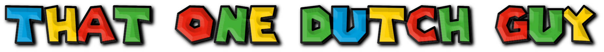

<strong> 🕹️ That One Dutch Guy's Shit Ass Toybox</strong>

  
   
  

---

> Inspirational quote: "Mah boi, this webgame development is what all true programmers strive for!" 👑👾

---

<strong>⚠️ BREAKING NEWS!</strong>

**The site has relocated to a brand new repository!**  
**I wanted to start clean again because I need a new url for the new rebranded site and the old one had too many commits!**  

---

<strong>⚠️ HUGE NEW HUB UPDATE!</strong>

* Rebranded from That One Dutch Guy's Mini-Game Hub to That One Dutch Guy's Shit Ass Toybox! ✨
* Added the Mini Toybox with various hilarious meme toyz! 🤣
* Added fabulous little background images to all of the game cards! 🦄
* Added a warning splash screen that is really, really fucking informative, man! 😅
* Changed the layout of the whole main site while still staying eye-bleedingly fabulous! 😎
* Added an actual background music track, replacing that old ass web-synthesized tune! 🎵
* Added a music toggle button, but you wouldn't dare actually use it... right?! 🥺
* Added an ABOUT button so you can read the fabulous README.md on the page! 📖
* Added a banning system for mobile phones, tablets, iPad, and even fucking Smart Fridges! 🚫
* And so much more! Go visit and find out! 👇🏻

---

<strong>🎮️ List of currently available toys and games</strong>

**GAMES:**

* Bup The Super Awesome Clicker Game (Finished, unless I come up with some big brain additions)
* Philips CD-i Meme Soundboard (Finished, unless I come up with some big brain additions)
* Rick Roller 2D (Beta / WIP)
* Weegee Memory Match (Finished, unless I come up with some big brain additions)
* Weegee Town XP (Beta / WIP)
* Weegee's Mansion 3D (Finished, unless I come up with some big brain additions)
* Whack A Meme (Finished, unless I come up with some big brain additions)
* King Harkinian's Personal Chef Simulator

---

**TOYS:**

* MLG Airhorn Toy
* Pingas Toy
* Dinner Toy
* Mama Luigi Toy

---

<strong>🚨 GAME UPDATE!</strong>

> King Harkinian's Personal Chef Simulator  

<strong>Version 1.1 is now out for the game!</strong>

<strong>Changelog</strong>

* Added two brand new meals to cook! 🧑🏻‍🍳
* Made the font selection better with an awful mix of Charlemagne Std Bold and Comic Sans! 🔤
* Added cooking timers to all appliances, just to make y'all suffer even more! 🎛️🥘🍲
* And so much more! Go check it out! Or else... 🔫

---

<strong>🚨 BREAKING NEWS ABOUT WEEGEE'S MANSION 3D!</strong>

> Weegee's Mansion 3D is finally coming out of Beta / WIP and getting it's full 1.0 release!
> Here are several new things added to the game and bug fixes:

* Added controller support specifically for DualShock 4 controllers! 🎮️
* Fixed that stupid z-fighting issue with the walls, finally! 🧱
* Added two new items: The Plunger and the Banana Peel! 🪠🍌
* Increased the hotbar slots from four to five! 🔳
* Added new sound effects for various things! 🔊
* Added proper info tabs on the main menu! 📋️
* AND SO MUCH MORE! GO CHECK IT OUT, OR ELSE... 🔫

---

<strong>⏮️ THE PREVIOUS UPDATE!</strong>

* I'm too lazy to note all of that shit down, lol, cuz it's a lot!

---

> 👉🏻 [Go check it out live!](https://that1dutchguy1.github.io/thatonedutchguys-shit-ass-toybox.github.io/)

---

<strong>📝 Project Overview</strong>

<strong>This is a work-in-progress minigame hub that I am currently developing as a fun side project!</strong>

<strong>For those who don't know me, I am a retired YouTuber known as That One Dutch Guy.   If you want a quick laugh and loose braincells simultaneously, then feel free to check out some of my old videos! More interactive toys and games will be continually added here in the future.</strong>

---

<strong>💬 Q & A</strong>

> **Q: Is this site mobile friendly?**   
> **A:** Why don't you shut the fuck up and grab something with a keyboard and mouse / trackpad? 😁

> **Q: When will the site be finished?**   
> **A:** Honestly? I don't know. Maybe when I run out of inspiration, but that ain't gonna happen anytime soon! 👍🏻

> **Q: Is the code AI generated?**   
> **A:** Partially. I frequently use AI tools to help me debug and brainstorm when I get stuck. However, I make sure not to overuse it, and I meticulously verify every snippet of code the AI provides before merging it. Don't judge me. 🤷🏻‍♂️

> **Q: Will you ever return to making YouTube videos?**   
> **A:** Highly unlikely! However, I might consider creating new content if I ever find myself with an abundance of free time down the road. If I do make a return, the content will likely focus on web development topics! 🌐

> **Q: How do you come up with this beautiful shit?**  
> **A:** Having both autism and ADHD, and having hyperfocuses on both stupid old memes and webdevelopment! 🤣

> **Q: Will you really come after me with a shotgun if I try to play one of your games on mobile?**  
> **A:** Yes I will. Without a doubt. 🙃

> **Q: Which operating system do you work on?**  
> **A:** A system I delightfully call "The Cinnamon XP Meme Machine"! It's a very dedicated mod collection to make Linux Mint 22 Cinnamon Edition look and sound like Windows XP! 😁

---
