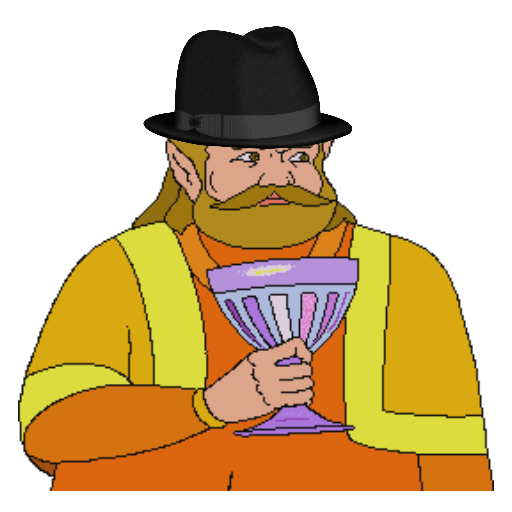

<strong> 🕹️ That One Dutch Guy's Shit Ass Toybox</strong>

  
   
  

---

> Inspirational quote: "Mah boi, this webgame development is what all true programmers strive for!" 👑👾

---

<strong>⚠️ BREAKING NEWS!</strong>

**The site has relocated to a brand new repository!**  
**I wanted to start clean again because I need a new url for the new rebranded site and the old one had too many commits!**  

---

<strong>⚠️ HUGE NEW HUB UPDATE!</strong>

* Rebranded from That One Dutch Guy's Mini-Game Hub to That One Dutch Guy's Shit Ass Toybox! ✨
* Added the Mini Toybox with various hilarious meme toyz! 🤣
* Added fabulous little background images to all of the game cards! 🦄
* Added a warning splash screen that is really, really fucking informative, man! 😅
* Changed the layout of the whole main site while still staying eye-bleedingly fabulous! 😎
* Added an actual background music track, replacing that old ass web-synthesized tune! 🎵
* Added a music toggle button, but you wouldn't dare actually use it... right?! 🥺
* Added an ABOUT button so you can read the fabulous README.md on the page! 📖
* Added a banning system for mobile phones, tablets, iPad, and even fucking Smart Fridges! 🚫
* And so much more! Go visit and find out! 👇🏻

---

<strong>🕹️ List of currently available toys and games</strong>

**GAMES:**

* Bup The Super Awesome Clicker Game (Finished, unless I come up with some big brain additions)
* Philips CD-i Meme Soundboard (Finished, unless I come up with some big brain additions)
* Rick Roller 2D (Beta / WIP)
* Weegee Memory Match (Finished, unless I come up with some big brain additions)
* Weegee Town XP (Beta / WIP)
* Weegee's Mansion 3D (Finished, unless I come up with some big brain additions)
* Whack A Meme (Finished, unless I come up with some big brain additions)
* King Harkinian's Personal Chef Simulator (Finished, unless I come up with some big brain additions)
* CD-i Tinder (Alpha / WIP)
* Meme Claw Machine (I dunno, stable, logic works, but might add more shit in the future)
* The Big Meme Quiz (Finished, unless I come up with some big brain additions)

---

**TOYS:**

* MLG Airhorn Toy
* Pingas Toy
* Dinner Toy
* Mama Luigi Toy

---

<strong>🚨 NEW GAME ADDED!</strong>

> Meme Mafia has been added to the Shit Ass Toybox! Fuck yeah! 🤵🏻‍♂️🎩🚬

> Don Harkinian is the boss of the OG Meme Crime Family! 🤵🏻‍♂️  
> He hired you to help him and his henchmemes defeat their rivals: The Gen Alpha Meme Crime Family! 😯  
> Led by Don Skibidi, they seem unstoppable! Unless one person helps the OGs, and that is YOU! 🫵🏻
> Assemble hit parties and launch attacks on the Gen Alpha memes! 🔫
> NOW GO PLAY THE GAME MOTHERFUCKER! 🔫

---

<strong>🚨 ANOTHER BIG WEEGEE'S MANSION 3D UPDATE!</strong>

> I think this is 1.6 (I lost track lol but I'm gonna call it that anyway! 😂)
> Here are several new things added to the game and bug fixes:

* Weegee can now HEAR you! 👂🏻
* Every sound you make now matters! 😈
* Sneaking has been added to reduce footstep noise! 🥷🏻
* If Weegee hears you, he WILL come to investigate! 😱
* Fixed a few fucking annoying bugs! 🙄
* AND SO MUCH MORE! GO CHECK IT OUT, OR ELSE... 🔫

---

<strong>🚨 SMALL KING HARKINIAN'S PERSONAL CHEF SIMULATOR UPDATE!</strong>

* Added asset preloading for all of the assets so that the King arrives more smoothly! 😎
* Added a fucking fabulous loading screen on enter so that the browser got the time to preload all the assets! 👌🏻
* A few bug fixes here and there! 👾

---

<strong>🎮️ CONTROLLER SUPPORT UPDATE!</strong>

> Added controller support for navigating the Shit Ass Toybox! 🎮️  
> Added controller support for Meme Claw Machine! 🎮️  

---

<strong>🚨 SMALL BUP THE SUPER AWESOME CLICKER GAME UPDATE!</strong>

* Added local storage for the milestone messages so that they won't repeat anymore when you reach the threshold again! 😉
* Made a few small changes to the Mama Luigi gamble! 🎰

---

<strong>⏮️ THE PREVIOUS UPDATE!</strong>

> Fuck, I don't remember! 😂

---

> 👉🏻 [Go check it out live!](https://that1dutchguy1.github.io/thatonedutchguys-shit-ass-toybox/)

---

<strong>📝 Project Overview</strong>

<strong>This is a work-in-progress minigame hub that I am currently developing as a fun side project!</strong>

<strong>For those who don't know me, I am a retired YouTuber known as That One Dutch Guy.   If you want a quick laugh and loose braincells simultaneously, then feel free to check out some of my old videos! More interactive toys and games will be continually added here in the future.</strong>

---

<strong>💬 Q & A</strong>

> **Q: Is this site mobile friendly?**   
> **A:** Why don't you shut the fuck up and grab something with a keyboard and mouse / trackpad? 😁

> **Q: When will the site be finished?**   
> **A:** Honestly? I don't know. Maybe when I run out of inspiration, but that ain't gonna happen anytime soon! 👍🏻

> **Q: Is the code AI generated?**   
> **A:** Partially. I frequently use AI tools to help me debug and brainstorm when I get stuck. However, I make sure not to overuse it, and I meticulously verify every snippet of code the AI provides before merging it. Don't judge me. 🤷🏻‍♂️

> **Q: Will you ever return to making YouTube videos?**   
> **A:** Highly unlikely! However, I might consider creating new content if I ever find myself with an abundance of free time down the road. If I do make a return, the content will likely focus on web development topics! 🌐

> **Q: How do you come up with this beautiful shit?**  
> **A:** Having both autism and ADHD, and having hyperfocuses on both stupid old memes and webdevelopment! 🤣

> **Q: Will you really come after me with a shotgun if I try to play one of your games on mobile?**  
> **A:** Yes I will. Without a doubt. 🙃

> **Q: Is this website child friendly?**  
> **A:** I'm not your kid's daycare supervisor or whatever, sir / ma'am. If you actually READ this README, then you know! 🙄

> **Q: What do you do in your free time mostly nowadays?**  
> **A:** Coding, duh, jerk off to Pornhub videos, blast Megadeth, Slayer and Anthrax, watch YTP, make memes, and so much more bullshit! 😎

> **Q: Which operating system do you work on?**  
> **A:** A system I delightfully call "The Cinnamon XP Meme Machine"! It's a very dedicated mod collection to make Linux Mint 22 Cinnamon Edition look and sound like Windows XP! 😁

> **Q: What are your computer's specs?**  
> **A:** RTX 2070 Super - Ryzen 5 5600X - ASRock B550 Steel Legend motherboard   32 GB DDR4 RAM - 256 GB SATA III portable SSD (OS)   512 GB NVMe SSD (for large 3D games) - 4 TB HDD (old games and misc) 🖥️

> **Q: Do you have an OnlyFans account?**  
> **A:** Oh, you wish I had for sure! But OnlyFans thinks I'm too fabulous for their platform! 🦄

> **Q: If you had a theme song, what would it be?**  
> **A:** Startin' Up a Posse - Anthrax! Why? Because it doesn't hold back and is against censorship, just like me! 🤪🖕🏻

---
